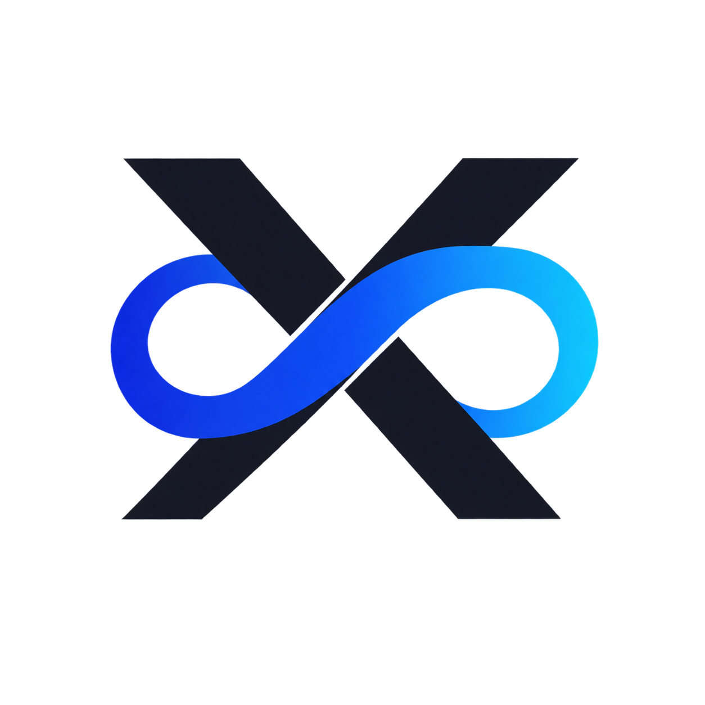

<!-- Don't delete it -->
<div name="readme-top"></div>

<!-- Organization Logo -->
<div align="center" style="display: flex; align-items: center; justify-content: center; gap: 16px;">
  
  
</div>

&nbsp;

<!-- Organization/Project Social Handles -->
<p align="center">
<!-- Telegram -->
<a href="https://t.me/+bMWGzaMTMa8xN2Ex">
</a>
&nbsp;&nbsp;
<!-- X (formerly Twitter) -->
<a href="https://x.com/aossie_org">
</a>
&nbsp;&nbsp;
<!-- Discord -->
<a href="https://discord.gg/hjUhu33uAn">
</a>
&nbsp;&nbsp;
<!-- LinkedIn -->
<a href="https://www.linkedin.com/company/aossie/">
  </a>
&nbsp;&nbsp;
<!-- Youtube -->
<a href="https://www.youtube.com/@AOSSIE-Org">
  </a>
</p>

<p align="center">
  <a href="https://scorecard.dev/viewer/?uri=github.com/AOSSIE-Org/XOps">
    
  </a>
  &nbsp;&nbsp;
  <a href="./BestPracticesChecklist.md">
    
  </a>
  &nbsp;&nbsp;
  <a href="https://github.com/gitleaks/gitleaks">
    
  </a>
</p>

---

<div align="center">
<h1>XOps</h1>
</div>

**XOps** is a CI/CD-native value transfer engine, shipped as a versioned GitHub Action. A
repository event (e.g. a merged PR) produces a payment intent, a human signs it, the workflow
settles it on-chain, and a receipt is posted back — with no server operated by the project and no
secrets required in the default configuration.

---

## 🚀 Features

- **Runs in your CI, not ours** — ships as a GitHub Action (`uses: AOSSIE-Org/xops@v1`); the
  maintaining project operates no backend and never holds funds.
- **Safe by default** — `mode: dry-run` unless explicitly opted out; a fresh integration needs
  zero secrets.
- **Built on x402 v2** ([Linux Foundation standard](https://github.com/x402-foundation/x402)) —
  first driver implements the `exact` scheme over EIP-3009 `transferWithAuthorization` (USDC).
- **Strict layer boundary** — the core engine and adapters never import a chain library, hash
  primitive, or token address; every rail lives behind a `SettlementDriver` in `src/drivers/`.
  See [AGENTS.md](AGENTS.md) for the enforced invariants.
  Adding a network is a config-only change, verified in CI by diffing that no core files changed.
- **Idempotent by construction** — re-running a workflow reproduces the same settlement key;
  `AUTH_ALREADY_USED` is treated as success, not failure.
- **Minimal dependency surface** — runtime dependencies are capped at 2 packages
  (`@noble/curves`, `@noble/hashes`), enforced in CI.

---

## 💻 Tech Stack

- **Runtime:** Node.js ≥ 20, TypeScript, bundled with `@vercel/ncc` into a committed `dist/`
- **Distribution:** GitHub Action (`action.yml`, `using: node20`)
- **Protocol:** [x402 v2](https://github.com/x402-foundation/x402) — `exact` scheme, EIP-3009 /
  EIP-712, CAIP-2 network identifiers
- **Chain (Tier 1 target):** Base Sepolia, USDC — see `assets/chains.json`
- **CLI:** `npx xops verify | encode` — fully offline, no keys or network required

---

## 🔗 Repository Links

- [Main Repository](https://github.com/AOSSIE-Org/XOps)

---

## 🏗️ Architecture

Six layers, one rule: nothing in `src/core/**` or `src/adapters/**` may import a chain library,
token address, RPC URL, or chain-specific primitive. See [AGENTS.md](AGENTS.md) for the full
rationale and the CI-enforced invariants (I1–I13).

```
L5 RECEIPT       SettlementResponse → PR comment + machine-readable receipt
L4 SETTLEMENT    driver registry: (scheme × network) → driver   ← only layer that knows rails
L3 AUTHORIZATION PaymentPayload — who approved, cryptographically
L2 INTENT        PaymentRequirements — what moves, to whom
L1 POLICY        offline gates, no network
L0 TRIGGER       repo event → Intent
```

---

## 🍀 Getting Started

### Prerequisites

- Node.js ≥ 20
- npm

### Using the Action

No secrets are required for the default `dry-run` path:

```yaml
# .github/workflows/reward.yml
on:
  issue_comment: { types: [created] }
permissions: { issues: write, pull-requests: write }
jobs:
  pay:
    if: startsWith(github.event.comment.body, '/send')
    runs-on: ubuntu-latest
    steps:
      - uses: AOSSIE-Org/xops@v1
```

### Developing Locally

```bash
git clone https://github.com/AOSSIE-Org/XOps.git
cd XOps
npm install
npm run check   # lint + layer-boundary check + dependency-count check + tests
```

See [CONTRIBUTING.md](./CONTRIBUTING.md) for the full contribution workflow and
[ROADMAP.md](./ROADMAP.md) for what's being built and in what order.

---

## 🙌 Contributing

⭐ Don't forget to star this repository if you find it useful! ⭐

Thank you for considering contributing to this project! Contributions are highly appreciated and welcomed. To ensure smooth collaboration, please refer to our [Contribution Guidelines](./CONTRIBUTING.md).

---

## ✨ Maintainers

See [MAINTAINERS.md](./MAINTAINERS.md) for maintainers, mentors, and ideators.

---

## 📍 License

This project is licensed under the MIT License.
See the [LICENSE](LICENSE) file for details.

---

## 💪 Thanks To All Contributors

Thanks a lot for spending your time helping XOps grow. Keep rocking 🥂

[](https://github.com/AOSSIE-Org/XOps/graphs/contributors)

© 2026 AOSSIE
